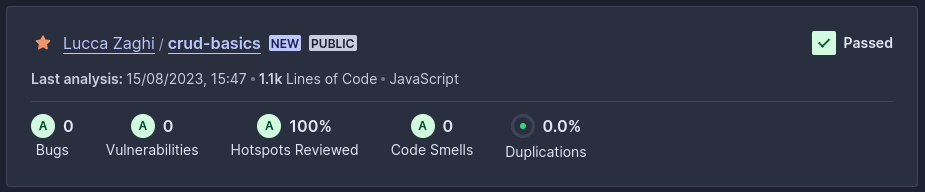

# CRUD basics - Store Manager

Essa é uma implementação de uma API RESTful, com uso de Node.js, Express.js do banco de dados MySQL. É um sistema de gerenciamento de uma loja, que possibilita o usuário a criar, visualizar, deletar e atualizar produtos e vendas.
A aplicação foi construída com a arquitetura MSC (model-service-controller) e foi Dockerizada.
Tudo isso com validações e testes pensados para os casos de uso da aplicação, garantindo a qualidade e integridade do código.

O foco dessa projeto foi praticar a construção de um sistema CRUD completo, assim como explorar a arquitetura MSC para construção de uma API robusta, escalável e de fácil manutenção.

## Instalação e execução local

Para rodar esta aplicação é necessário ter o Docker e o Docker Compose (v1.29 ou superior) instalados em sua máquina.

1. Clone o repositório e entre no diretório
```bash
  git clone git@github.com:lzaghi/crud-basics.git
  cd crud-basics
```

2. Instale as dependências 
```bash
  npm install
```

3. Suba os containeres do Node e do MySQL
```bash
  docker-compose up -d --build
```

4. Rode o comando para abrir o terminal do container Node
```bash
  docker exec -it store_manager bash
```

5. Rode o comandos para criar e popular as tabelas
```bash
  npm run migration
  npm run seed
```
Essa etapa também pode ser feita diretamente a partir de um cliente MySQL de sua preferência, como o MySQL Workbench.
Conecte-se na porta ```3006``` com as credenciais de user ```root``` e senha ```password```, e execute os scrips nos arquivos ```migration.sql``` e ```seed.sql```.

6. Inicie a aplicação
```bash
  npm start
```
A aplicação estará rodando em ```http://localhost:3000```

Para rodar os testes
```bash
  npm run test:mocha
```

## Documentação

A documentação completa da API pode ser consultada na rota ```http://localhost:3000/swagger```


Segue um resumo do que é documentado na rota acima:
<details>
<summary><strong>Especificações das requisições</strong></summary>

<strong>Cadastrar produto</strong>

```http
POST /products
```
<details><summary>Exemplo de Entrada:</summary></br>

```json
{
  "name": "ProdutoX"
}
```

</details>

<details><summary>Exemplo de retorno:</summary></br>

Em caso de sucesso - status 201:
```json
{
  "id": "4",
  "name": "ProdutoX"
}
```

Em caso de erro - status 400:
```json
{
  "message": "'name' is required"
}
```
Ou status 422:
```json
{
  "message": "'name' length must be at least 5 characters long"
}
```
</details>
-

<strong>Consultar produtos</strong>

```http
GET /products
```
<details><summary>Exemplo de retorno:</summary></br>

Status 200:
```json
[
  {
    "id": 1,
    "name": "Martelo de Thor"
  },
  {
    "id": 2,
    "name": "Traje de encolhimento"
  },
  {
    "id": 3,
    "name": "Escudo do Capitão América"
  }
]
```
</details>
-

<strong>Consultar produto por nome</strong>

```http
GET /products/search
```
<details><summary>Exemplo de Pesquisa:</summary></br>

```http
URL http://localhost:3000/products/search?q=martelo
```

</details>

<details><summary>Exemplo de retorno:</summary></br>

Sucesso - status 200:
```json
[
  {
    "id": 1,
    "name": "Martelo de Thor"
  }
]
```

</details>
-

<strong>Consultar produto por id</strong>

```http
GET /products/{id}
```
<details><summary>Exemplo de Pesquisa:</summary></br>

```http
URL http://localhost:3000/products/3
```

</details>
<details><summary>Exemplo de retorno:</summary></br>

Em caso de sucesso - status 200:
```json
{
  "id": 3,
  "name": "Escudo do Capitão América"
}
```
Em caso de erro - status 404:
```json
{
  "message": "Product not found"
}
```

</details>
-

<strong>Atualizar produto</strong>

```http
PUT /products/{id}
```
<details><summary>Exemplo de Entrada:</summary></br>

```http
URL http://localhost:3000/products/3
```
```json
{
  "name": "ProdutoX"
}
```

</details>
<details><summary>Exemplo de retorno:</summary></br>

Em caso de sucesso - status 200:
```json
{
  "id": 3,
  "name": "ProdutoX"
}
```
Em caso de erro - status 400:
```json
{
  "message": "'name' is required"
}
```
Ou status 404:
```json
{
  "message": "Product not found"
}
```
Ou status 422:
```json
{
  "message": "'name' length must be at least 5 characters long"
}
```

</details>

<strong>Deletar produto</strong>

```http
DELETE /products/{id}
```
<details><summary>Exemplo de retorno:</summary></br>

Em caso de sucesso - status 204:
```http
no content
```
Em caso de erro - status 404:
```json
{
  "message": "Product not found"
}
```

</details>
-

<strong>Cadastrar venda</strong>

```http
POST /sales
```
<details><summary>Exemplo de Entrada:</summary></br>

```json
[
  {
    "productId": 2,
    "quantity": 5
  }
]
```

</details>

<details><summary>Exemplo de retorno:</summary></br>

Em caso de sucesso - status 201:
```json
{
  "id": 3,
  "itemsSold": [
    {
      "productId": 2,
      "quantity": 5
    }
  ]
}
```

Em caso de erro - status 400:
```json
{
  "message": "'productId'/'quantity' are required"
}
```
Ou status 404:
```json
{
  "message": "Product not found"
}
```
Ou status 422:
```json
{
  "message": "'quantity' must be greater than or equal to 1"
}
```
</details>
-

<strong>Consultar vendas</strong>

```http
GET /sales
```
<details><summary>Exemplo de retorno:</summary></br>

Status 200:
```json
[
  {
    "saleId": 1,
    "date": "2023-08-15T20:30:31.000Z",
    "productId": 1,
    "quantity": 5
  },
  {
    "saleId": 1,
    "date": "2023-08-15T20:30:31.000Z",
    "productId": 2,
    "quantity": 10
  },
  {
    "saleId": 2,
    "date": "2023-08-15T20:30:31.000Z",
    "productId": 3,
    "quantity": 15
  }
]
```
</details>
-

<strong>Consultar venda por id</strong>

```http
GET /sales/{id}
```
<details><summary>Exemplo de Pesquisa:</summary></br>

```http
URL http://localhost:3000/sales/2
```

</details>
<details><summary>Exemplo de retorno:</summary></br>

Em caso de sucesso - status 200:
```json
[
  {
    "date": "2023-08-15T20:30:31.000Z",
    "productId": 3,
    "quantity": 15
  }
]
```
Em caso de erro - status 404:
```json
{
  "message": "Sale not found"
}
```

</details>
-

<strong>Atualizar venda</strong>

```http
PUT /sales/{id}
```
<details><summary>Exemplo de Entrada:</summary></br>

```http
URL http://localhost:3000/sales/2
```
```json
[
  {
    "productId": 2,
    "quantity": 50
  }
]
```

</details>
<details><summary>Exemplo de retorno:</summary></br>

Em caso de sucesso - status 200:
```json
{
  "saleId": 2,
  "itemsUpdated": [
    {
      "productId": 2,
      "quantity": 50
    }
  ]
}
```
Em caso de erro - status 400:
```json
{
  "message": "'productId'/'quantity' are required"
}
```
Ou status 404:
```json
{
  "message": "Product not found"
}
```
Ou status 422:
```json
{
  "message": "'quantity' must be greater than or equal to 1"
}
```

</details>
-

<strong>Deletar venda</strong>

```http
DELETE /sales/{id}
```
<details><summary>Exemplo de retorno:</summary></br>

Em caso de sucesso - status 204:
```http
no content
```
Em caso de erro - status 404:
```json
{
  "message": "Sale not found"
}
```

</details>
</details>

## Tecnologias utilizadas

Node.js, Express.js, MySQL, Docker, Joi, Mocha, Chai, Sinon, Arquitetura MSC, API RESTful

## Qualidade de Código

Análise SonarCloud


